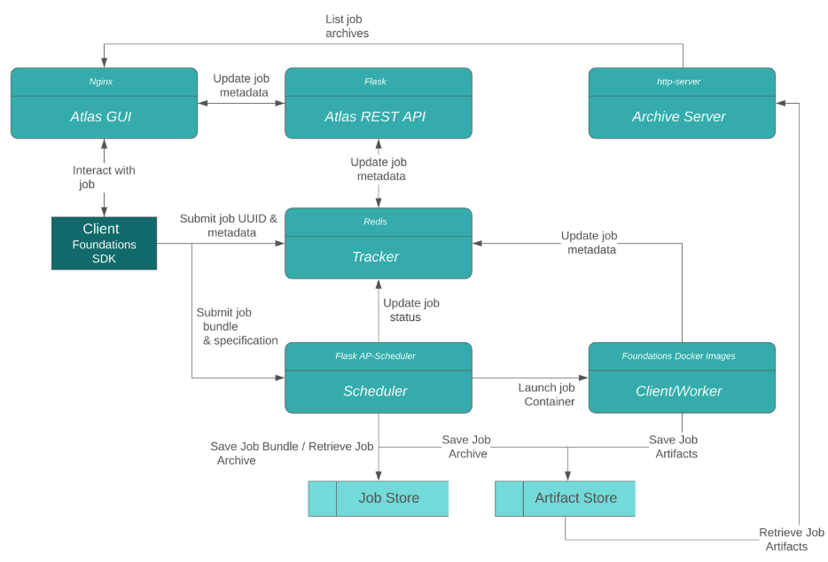

[](https://jenkins.shehanigans.net/job/atlas/job/master/)


<p align="center">
  
</p>

---

# Atlas: Self-Hosted Machine Learning Platform
Atlas is a flexible Machine Learning platform that consists of a Python SDK, CLI, GUI & Scheduler to help Machine Learning Engineering teams dramatically reduce the model development time & reduce effort in managing infrastructure.

## Features
Here are few of the high-level features:
1. _Self-hosted_: run Atlas on a single node e.g. your latop, or multi-node cluster e.g. on-premise servers or cloud clusters (AWS/GCP/etc.)
2. _Job scheduling_: Collaborate with your team by scheduling and running concurrent ML jobs remotely on your cluster & fully utilize your system resources.
3. _Flexibility_: Multiple GPU jobs? CPU jobs? need to use custom libraries or docker images? No problem - Atlas tries to be unopionated where possible, so you can run jobs how you like.
4. _Experiment managment & tracking_: Tag experiments and easily track hyperparameters, metrics, and artifacts such as images, GIFs, and audio clips in a web-based GUI to track the performance of your models.
5. _Reproducibility_: Every job run is recorded and tracked using a job ID so you can reproduce and share any experiment.
6. _Easy to use SDK_: Atlas's easy to use SDK allows you to run jobs programatically allowing you to do multiple hyperparameter optimization runs programatically
7. _Built in [Tensorboard](https://github.com/tensorflow/tensorboard) integration_: We ❤️ Tensorflow - compare multiple Tensorboard-compaitable job runs directly through the Atlas GUI.
8. _Works well with others_: run any Python code with any frameworks.

<p align="left">
  
</p>

# Users guide

## Installation 

* [MacOS & Linux Quickstart Guide (~8 mins, recommended)](https://docs.atlas.dessa.com/en/latest/linux-ac-installation)
* [Windows 10 Guide](https://docs.atlas.dessa.com/en/latest/windows-installation)
* [AWS Cloud installation](https://docs.atlas.dessa.com/en/latest/team/atlas-on-aws)
* [GCP Cloud installation](https://docs.atlas.dessa.com/en/latest/atlas-on-gcp)
* Multi-node cluster deployment:
  * [AWS guide](https://docs.atlas.dessa.com/en/latest/team/aws-installation)
  * [On-prem cluster guide](https://docs.atlas.dessa.com/en/latest/team/on-prem-installation).

## Documentation
Official documentation for Atlas can be found at https://www.docs.atlas.dessa.com/

All docs are hosted on Read the Docs that track the `docs` folder, please open a pull request here to make changes. 

## Community 
If you have questions that are not addressed in the [documentation](https://www.docs.atlas.dessa.com/), there are several ways to ask: 
- Open a [Github Issue](https://github.com/dessa-research/atlas/issues)
- [Stack Overflow](https://stackoverflow.com/questions/tagged/foundations-atlas) - be sure to use the `foundations-atlas` tag.
- Join the [Dessa Slack](https://join.slack.com/t/dessa-community/shared_invite/enQtNzY5ODkxOTc3OTkwLTk4MTg5NmNkOTQ5OWVjNjk2YzY0OWJlNDkwNDlhY2NmNTQzNmRmYjkxNzc2N2JiOTYxZGVkMmFiMjRhYThiYzM).

We will do our best to help!

# Development Guide

## Development Status
Atlas has evolved very rapidly and has gone though many iterations in Dessa's history. 

The latest version is in BETA. 

## Contributing
We ❤️ contributors and would love to work with you. 

Atlas is currently open to external contributors.

Follow this guide:
* Found a Bug?
  * Search through the [issue list](https://github.com/DeepLearnI/atlas/issues?q=is%3Aopen+is%3Aissue+label%3Abug) to make sure an issue doesn't exist already.
  * File an issue with the following:
    * Label as `bug`
    * Steps to reproduce 
    * System used 
  * Got a fix? 
    * Tag the issue you are fixing 
    * Open a Pull Request. 
* Requesting a feature?
  * Search through the [issue list](https://github.com/DeepLearnI/atlas/issues?q=is%3Aopen+is%3Aissue+label%3Afeature-request) to make sure an issue doesn't exist already.
  * File an issue with the following:
    * Label as `feature-request`
    * Why is this important to you? 
    * How will this impact a data scientists workflow?
    * Add any relevant mockups (if it is user facing)
  * Want to work on it?
    * Open up a Pull Request! 
* First-time contributor to OSS?
  * Look for issues with the `first-timers-only` label and get help from the community Slack if you need it. 

## Development Setup 
When you are ready, just follow the steps below in order to set up a development environment.

1. You will need to have `docker`, `yarn`, and the `envsubst` command line tool on your machine in order spin up a local development environment.    
  `brew install docker`  
  `brew install yarn`  
  `brew install gettext`  
  If you are on a linux machine then replace `brew install` with the equivalent command for your distributions package manager.  

2. Clone this repository and enter the new directory  
  `git clone git@github.com:DeepLearnI/atlas.git && cd atlas`  

3. Create and activate a brand new virtual environment with Python 3.7 then install the requirements. Some examples below.
   Conda:  
    `conda create --name foundations python=3.7 && conda activate foundations`  
    `pip install -r requirements_dev.txt`  
   Pipenv:  
    `pipenv --python 3.7 && pipenv shell`  
    `pipenv install`  
    `pipenv install -r requirements_dev.txt --dev --pre --skip-lock`  
  Venv:  
    `python3 -m venv . && source bin/activate`  
    `pip install -r requirements_dev.txt`  

4. Add the packages that make up Atlas to your python path and set some environemnt variables by sourcing the `activate_dev_env.sh` file.  
   `. activate_dev_env.sh`   

5. Launch Atlas in development mode. This may take a while to pull some required docker images.  
   `make devenv-start`  

6. You can now create a sample project by running the following command.  
  `python -m foundations init my-project`  

7. Change into the newly created project directory and execute the following command to submit your first job. This can take a while the first time as one more image may need to be pulled.  
  `python -m foundations submit scheduler . main.py`  
   
8. Navigate to `localhost:3000` and verify that your newly created project exists on the frontend. Click on the project and verify that your job executed successfully.

9. Congrats! You are ready to go.

In order to run tests, simply run:  
  `make unit-tests`  
  `make integration-tests`  

To run the unit and integration tests respectfully.

## Systems Overview 
*Last updated: March 2020*

The following diagram shows a high level overview of how the Atlas system works. Note that Atlas's codebase evolves faster than this diagram and this diagram may not be kept upto date in real time. Still a good source to get a general understanding of the system.

<p align="center">
  
</p>

“Atlas Server” is the term that we use to describe all of the services that allow Atlas to do its magic. 

These services are as follows, note that some Atlas services live in other repos:
- Scheduler (code lives in [local-docker-scheduler](https://github.com/DeepLearnI/local-docker-scheduler))
- Worker
- Atlas GUI
- Atlas REST API
- Archive Server
- Tracker
- Authentication Proxy (code lives in [foundations-auth-proxy repository](https://github.com/DeepLearnI/foundations-auth-proxy))
- Authentication Server
- TensorBoard REST API
- TensorBoard Server

Let’s dive into each service with an explanation of their role within Atlas.

### Scheduler

This is a custom built Python scheduler that launches Docker based workers. It uses APSchedulr to keep track of and run jobs that are queued in the system. Users can interact with the scheduler through a Flask-based RESTful API to submit and interact with jobs. Jobs are submitted in the form of a “job spec”, which is simply a Python dictionary that describes the makeup of the job that will run.

The scheduler can run in both GPU and non-GPU mode. GPU mode will keep track of available devices and, given a job with a provided number of GPUs, will allocate jobs according to available resources.

Contribute to the Scheduler repository [here](https://github.com/DeepLearnI/local-docker-scheduler).

### Worker
This is what the scheduler uses to run any submitted jobs. The default Docker image used has a few libraries that are common in the machine learning/deep learning toolkit. However, users can specify a custom Docker image to use.

### Atlas GUI
The web application for Atlas is a React based service that displays and interacts with information provided by the REST API.

### Atlas REST API
This is Flask-based RESTful API that allows for interaction with Atlas specific information about jobs and projects. This includes information logged during the running of an Atlas job, notes on a project, and the markdown description of a project.

### Archive Server
We use a basic HTTP server to host the files and directories that are archived during an Atlas job. The information and path of each file is stored in the Tracker to be served when needed.

### Tracker
The tracker is the database where any saved information is stored. This includes information logged during the running of an Atlas job, notes on a project, and the markdown description of a project.

### Authentication Proxy
This is a very simplistic service that we route all API calls through. If the proxy is set to “null” (via the “-n” flag), all calls will pass through without any verification, otherwise the proxy will check for the validity of the supplied token before rerouting the call. The token is generated and checked against the Authentication Server.

Contribute to the authentication proxy repository [here](https://github.com/DeepLearnI/foundations-auth-proxy).

### Authentication Server
For our authentication system, we use the open source tool Keycloak. This gives us an off-the-shelf setup for managing and validating accounts.

### TensorBoard Server
This is the default Tensorflow image that provides the TensorBoard application. Most of the magic then happens in the TensorBoard REST API

### TensorBoard REST API
This system links files saved in the archive server that can be presented within TensorBoard and the directory that TensorBoard is using as a log directory. It makes these symlinks through a Flask-based RESTful API.

## License
```
Copyright 2015-2020 Square, Inc.

Licensed under the Apache License, Version 2.0 (the "License");
you may not use this file except in compliance with the License.
You may obtain a copy of the License at

   http://www.apache.org/licenses/LICENSE-2.0

Unless required by applicable law or agreed to in writing, software
distributed under the License is distributed on an "AS IS" BASIS,
WITHOUT WARRANTIES OR CONDITIONS OF ANY KIND, either express or implied.
See the License for the specific language governing permissions and
limitations under the License.
```